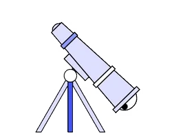
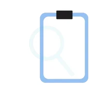

  

  
  

 
  Visitor count 
  

<!-- 

  
  
 -->

  
  

<h1 align="center">Hi  I'm DARPAN CHACHPARA</h1>
<h3 align="center">A passionate Software Engineer from India! Also freelancer  working remotely since 2021 </h3>
<!-- 

  

 -->
<!-- 
  
 -->
<!--   

 -->

 
 
 

  
- I’m currently working on **EdTech, FinTech**

- I’m currently learning **React, EIQ Hyper-Automation-Platform**

- I’m looking to collaborate on **Any Tech**

-  I’m looking for help with **MERN Stack** 
<code></code>
<code></code>
<code></code>
<code></code> 

- All of my projects are available at [https://github.com/Darpan-Chachpara?tab=repositories](https://github.com/Darpan-Chachpara?tab=repositories)

-  Ask me about 
**MongoDB <code></code>
React <code></code>
Nodejs <code></code> 
Express <code></code>
JavaScript <code></code>**

- How to reach me **darpanchachpara111@gmail.com**

<!-- - 📄 Know about my experiences [https://tinyurl.com/app](https://tinyurl.com/app) -->

- Fun fact **I use tabs over spaces**

<h3 align="left">Connect with me:</h3>

<h3 align="left">Languages and Tools:</h3>

                                   

<!-- 

&nbsp;
 -->

|  |  |
| ------------- | ------------- |

